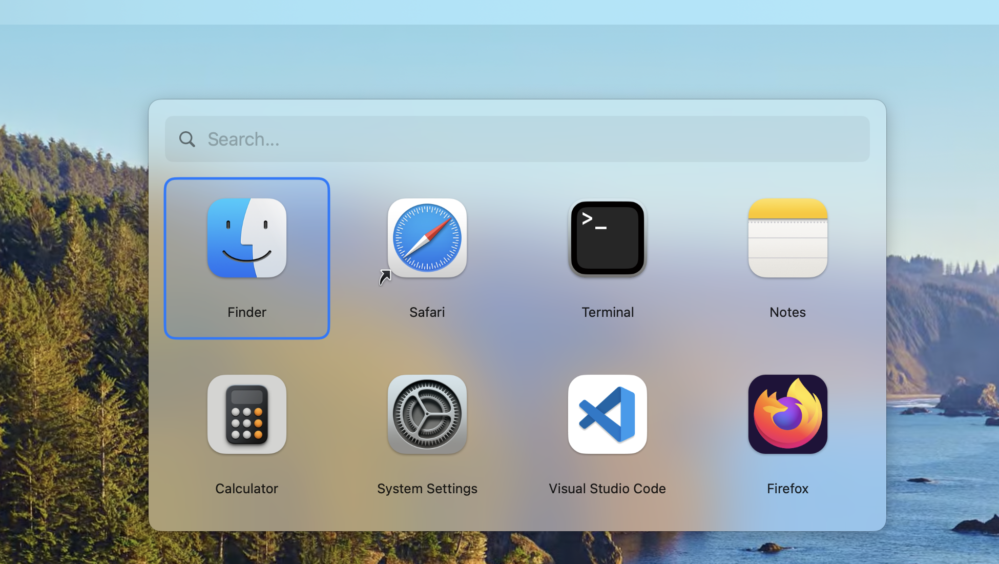
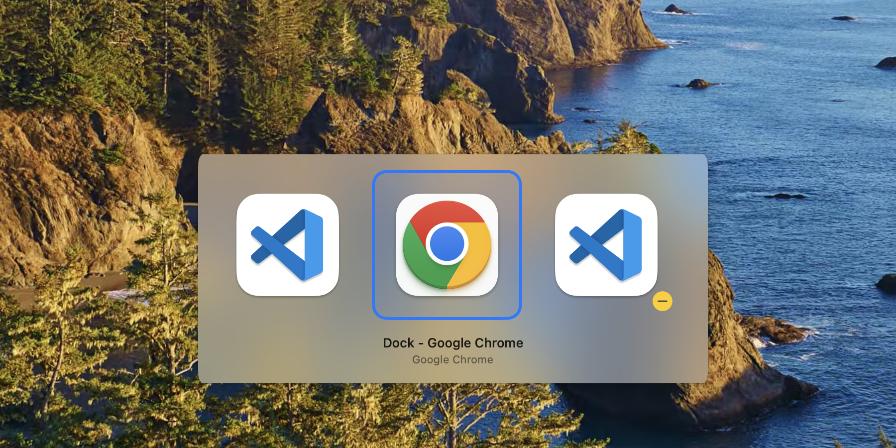

# Launchpick

Native macOS app launcher, window switcher, and same-app window cycler. Free and open source.

 

## Why

macOS makes three things surprisingly hard:

**Launching apps with parameters.** On Linux you create a `.desktop` file and you're done. On macOS there's no simple way to have a shortcut that opens, say, VS Code in a specific project folder. Automator is clunky, Shortcuts is limited, and the Dock doesn't support arguments.

**Switching between windows, not apps.** Cmd+Tab switches between *applications*. If you have 5 Chrome windows or 3 VS Code projects open, Cmd+Tab just takes you to "Chrome" — you can't pick which window. You can't see individual windows, you can't reach minimized windows. On Linux and Windows, Alt+Tab shows every window.

**Cycling between windows of the same app.** The built-in Cmd+\` skips minimized windows and doesn't work reliably across all apps. If you have 3 VS Code projects open, there's no quick key to cycle through all of them.

Launchpick solves all three in a single lightweight app.

### 1. Launcher panel — apps, URLs, scripts with custom arguments

One keyboard shortcut opens a grid where each icon launches a preconfigured command — an app, a URL, a script, or an app with specific arguments like a project folder. Type to search your launchers, plus all installed apps appear below.

**100% local search.** Unlike Spotlight or Windows Search, Launchpick never shows internet results, web suggestions, Siri suggestions, or ads. When you're trying to launch an app, you get apps — nothing else.



### 2. Window switcher — switch between windows, not apps

Option+Tab (configurable) shows every individual window across all apps — including minimized ones. Pick any VS Code project, any Chrome window, any Terminal session. Release the hold key to switch to it. Works exactly like Alt+Tab on Linux/Windows.



### 3. Same-app window cycling — jump between windows of the current app

Option+Cmd+P (configurable) cycles through windows of the current app — each press brings the next window to the front instantly, no UI needed. Works with minimized windows too. Useful when you have multiple VS Code projects, Chrome windows, or Terminal sessions open.

## Requirements

- **macOS 13 (Ventura) or later**
- Apple Silicon (M1, M2, M3, M4) or Intel Mac

## Download

Download the latest release for your Mac:

- **[Launchpick-AppleSilicon.dmg](https://github.com/scorredoira/launchpick/releases/latest/download/Launchpick-AppleSilicon.dmg)** — for Apple Silicon Macs (M1, M2, M3, M4)
- **[Launchpick-Intel.dmg](https://github.com/scorredoira/launchpick/releases/latest/download/Launchpick-Intel.dmg)** — for Intel Macs

Open the DMG and drag `Launchpick.app` to `/Applications`.

## Features

- **Launcher hotkey** (Cmd+Shift+Space by default) — toggle the launcher panel
- **Window switcher** (Option+Tab by default) — switch between all windows
- **Same-app cycling** (Option+Cmd+P by default) — cycle windows of the current app without UI
- **All shortcuts configurable** from Settings, including function keys (F1-F19)
- **App search** — type to filter launchers + installed apps (local only, no internet results)
- **Interactive shortcut recorder** — click and press keys to set shortcuts
- **Icon grid** with search/filter bar
- **Menu bar icon** with quick access to settings
- **Tilde expansion** — `~` in paths is resolved automatically
- **Tabbed settings UI** with Launchers and General tabs
- **Icon picker** with app icons, SF Symbols, and custom images
- **Auto-detect icons** from `open -a` commands
- **Launch at Login** toggle
- **JSON config** at `~/.config/launchpick/config.json`

## Launcher types

- **Open App**: launch any application, optionally with arguments (e.g., open VS Code with a specific project folder)
- **Open URL**: open any URL in the default browser
- **Shell Command**: run any shell command (supports full shell syntax: pipes, `;`, `&&`, redirects, etc.)
- **Kill & Restart**: use shell syntax to restart a process, e.g. `killall handy 2>/dev/null; handy`

## Permissions

### Accessibility (required for Window Switcher)

On first launch, macOS will show a dialog asking for Accessibility permission. This is needed for the window switcher to intercept keyboard events.

1. Click "Open System Settings" in the dialog
2. Toggle **Launchpick** ON in Privacy & Security > Accessibility

If you miss the dialog, go to **System Settings > Privacy & Security > Accessibility**, click **+**, press **Cmd+Shift+G**, type `/Applications/Launchpick.app`, and add it.

The app will automatically detect when permission is granted — no restart needed.

## Build from source

Requires macOS 13+ and Xcode Command Line Tools (`xcode-select --install`).

```bash
bash build.sh
```

This builds the app and creates `build/Launchpick.app`.

### Install from build

```bash
cp -r build/Launchpick.app /Applications/
open /Applications/Launchpick.app
```

## Config

The config file is created automatically on first launch at `~/.config/launchpick/config.json`. Example:

```json
{
  "shortcut": "cmd+shift+space",
  "switcherShortcut": "alt+tab",
  "sameAppSwitcherShortcut": "alt+cmd+p",
  "columns": 4,
  "launchers": [
    {
      "name": "Terminal",
      "exec": "open -a 'Terminal'"
    },
    {
      "name": "My Project",
      "exec": "open -a 'Visual Studio Code' '~/projects/my-project'",
      "icon": "/Applications/Visual Studio Code.app"
    },
    {
      "name": "GitHub",
      "exec": "open 'https://github.com'",
      "icon": "sf:globe"
    },
    {
      "name": "Restart Handy",
      "exec": "killall handy 2>/dev/null; sleep 0.5; open -a Handy",
      "icon": "sf:arrow.clockwise"
    }
  ]
}
```

### Icon options

- **Auto-detect** (default): resolves the icon from the `open -a` command
- **App icon**: path to a `.app` bundle (e.g., `/Applications/Safari.app`)
- **SF Symbol**: prefix with `sf:` (e.g., `sf:globe`, `sf:terminal.fill`)
- **Custom image**: path to any image file
